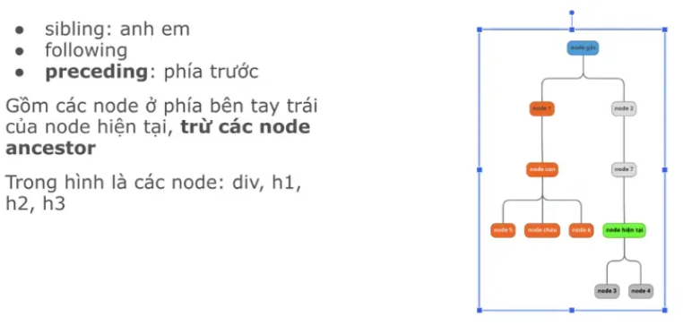
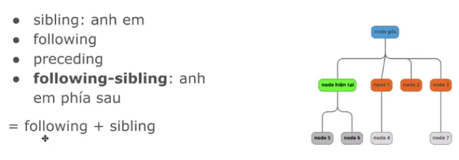
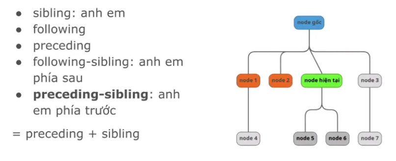

# Selector advenced

1. DOM - mối quan hệ

self: node hiện tại

parent: cha , node trên trực tiếp của node hiện tại

children: con, node dưới trược tiếp của node hiện tại

ancestor: tổ tiên, nằm cùng 1 trực hệ của node hiện tại ( node màu cam)

descendant: hậu duệ, tất cả các thẻ con cháu của node hiện tại

siling: anh em, ngang hàng, cùng cha

following: phía phải và phía dưới, không bao gồm con cháu của node hiện tại

preceding: 

following-sibling: anh em, cùng cấp, phía dưới

preceding-sibling

1. X-Path

wildcard *  : tìm cho tất cả k quan tâm tới thẻ

VD: //*[@id = ‘parent’]

and và or: thêm điều kiện

VD: //div[@id = ‘child’ and @class = ‘form-group’]

innerText: text() , có text ở giữa 

normalize-space(): loại bỏ khoảng trắng đầu cuối chỉ tìm text

VD: //label[normalize-space() = ‘Gender:’]

contains: dùng để chọn node có thuộc tính hoặc text chứa chuỗi con cụ thể

VD: //a[contains(text(), ‘Register Page’)]

starts-with: text bắt đầu bằng …

VD: //a[starts-with(text(), ‘Bài học 1: Register Page’)]

not: phủ định cái đang tìm

## Axes
- parent
    
    VD: //div[@class=”form-group” and @id = “child”]/parent::*
    
- child
- ancestor
- descendant
    
    VD: //form/descendant::input
    
- following: bao gồm các thẻ từ thẻ <table> trở xuống
    
    VD: //form/following::*
    
- Thêm [ ] : để tìm phần tử như thường
    
    VD: //form/following-sibling::*[@id = ‘userTable’]
    

