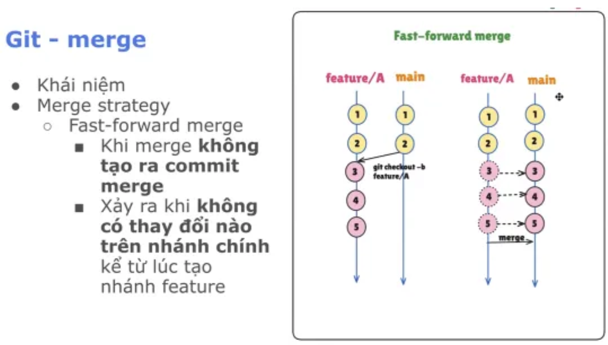
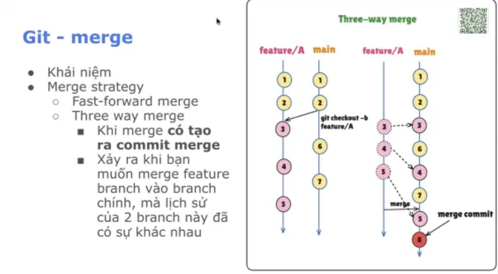
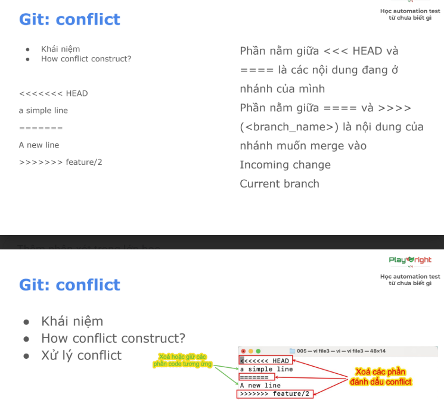
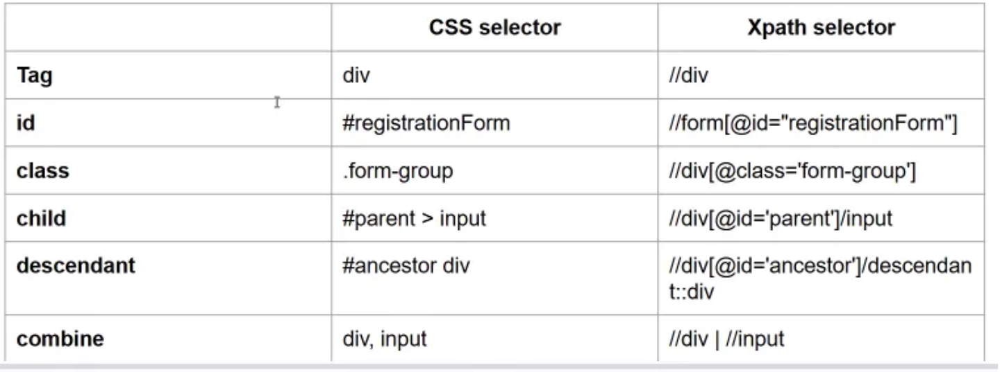

### 1. Git - merge

- Fast-forward merge: 
    
    
    
    - Khi merge không tạo ra commit merge
    - K có sự thay đổi trên lịch sử nhánh main từ lúc tạo nhánh mới

- Three way merge:
    

    - Khi merge tạo ra commit merge
    - Xảy ra khi muốn merge feature branch vào nhánh main mà lịch sử của 2 nhánh có sự khác biệt
    - Lịch sử nhánh main thay đổi theo dòng thời gian

### 2. Git - conflict
- Xảy ra khi 2 người cùng sửa 1 file và merge vào nhau

### 3. Git rebase
- Dùng để di chuyển hoặc kết hợp các commit từ nhánh này sang nhánh khác
- Thay vì tạo merge commit, rebase dán commit của bạn lên đầu nhánh khác

### 4. Git - squash
- Gộp nhiều commit nhỏ thành 1 commit lớn duy nhất, làm sạch lịch sử trước khi merge lên nhánh chính
- Git rebase -i HEAD~{số lượng commit muốn gộp}
- Đã merge vào main thì k nên dùng squash

### 5. CSS Selector
    - Cú pháp ngắn gọn hơn xpanth Tuy nhiên k thực hiện đc với những case khó
    - Role:
        
        
        
    - Dùng song song đc cả 2 xpath và css
* Tham khảo: https://css-selectors-cheatsheet.fullstack.edu.vn/assets/answers/CSS-selectors-cheatsheet.pdf 

## Note

**Sử dụng VIM**
- Để vào chế độ insert, gõ phím i (màn hình hiện INSERT ở góc dưới bên trái). 
- Để thoát khỏi chế độ insert, gõ phím “ESC” (màn hình biến mất INSERT ở góc dưới bên trái). 
- Để lưu và thoát: Gõ :wq (lưu ý có dấu “:” ở đầu. wq = write and quit) 
- Để thoát mà không lưu thay đổi, gõ q! (q! = force quit) 

**Git commands** 
- Để merge nhánh, dùng lệnh: git merge <tên_nhánh_cần_merge> 
- Để rebase nhánh, dùng lệnh: git rebase <tên_nhánh_cần_rebase> 
- Để squash 3 commit gần nhất, dùng lệnh: git rebase -i HEAD~3