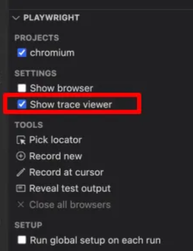

# 1. Async, await
- Async:
    - Đồng bộ là làm theo thứ tự lần lượt, chạy theo từng dòng
    - Bất đồng bộ là thực hiện chạy “song song” các dòng code ⇒ dẫn tới lỗi
- Await: Hàm nào trỏ vào nó hiện Promise thì cần await

⇒ Async, Await giúp tăng hiệu năng xử lý của hệ thống

# 2. Test generator
- Chạy câu lệnh để gen code trong terminer
    
    npx playwright codegen <url>
    

# 3. Visual comparison
- Chạy lần đầu fail và chụp lại màn hình đó ⇒ chạy lần 2 pass vì so sánh với ảnh chụp lần đầu khớp
- Mask locator: mask vùng, color đổi màu, che lại vùng k muốn so sánh
- Để update ảnh cho test case nào thì chạy hàm:
    - -update-snapshots
    - npx playwright test -g "@IMAGE" --update-snapshots

# 4. Video recoding
- Chạy xong thì có muốn record k ⇒ thêm vào file playwright.config.ts => trong user
    
    video: {
        mode: 'on',
        size: { width: 64, height: 480 }
    }
        
    - Có thể mặc định size video    
    - On: luôn quay video ⇒ video đc gen ra sau khi chạy
    - Off: k quay video
    - On-first-retry: Chỉ quay video khi test chạy lại lần đầu tiên sau khi fail
    - Retain-on-failure:
        - **Chỉ quay video nếu test fail**, và **chỉ giữ lại video đó**.
        - Nếu test **pass**, video (nếu có) sẽ bị **xóa sau khi chạy xong**.

# 5. Test report
- Log lại toàn bộ thông tin của trang web tại thời điểm test
    
    
    

# 6. Test emulation    
- Giả định: thiết bị, viewport, lacale and timezone,

# 7. Drag n Drop
- dragTo() : hàm Playwright hỗ trợ để thực hiện hành động kéo thả
- Drag manually: kéo thả thủ công khi web dùng custom JS
    
# 8. Global setup & teardown
    
- GlobalSetup: chạy trước khi tất cả các test chạy, chỉ chạy MỘT LẦN DUY NHẤT
- GlobalTeardown: chạy sau khi tất cả các test chạy, chỉ chạy MỘT LẦN DUY NHẤT

* Khác với fixture:

- Fixture chạy lại mỗi khi test chạy
- Global setup & teardown chỉ chạy 1 lần duy nhất

# 9. BỔ SUNG
- Chụp hình full page
    - Mặc định, khi chụp screenshot, playwright sẽ chỉ chụp màn hình trong viewport.
    - Để chụp toàn bộ trang web, bạn thêm option: fullPage: true vào trong screenShot option:
        
        await expect(page).toHaveScreenshot({
                  fullPage: true,
        });
        

- Emulation
    - Emulation giúp giả lập các thông tin như: locale (địa phương), timezoneId (múi giờ), permission (các quyền)...
    - Để giả lập các thông tin này, bạn có thể dùng test.use để giả lập ngay trong file test như sau:
        
        
        import { test, expect } from '@playwright/test';
        
        test.use({
               locale: "es_ES",
        
               timezoneId: "Europe/Madrid",
               permissions: ["camera"]
        });
        
        test('my test with geolocation', async ({ page }) => {
               await page.goto("https://material.playwrightvn.com/017-detect-user-agent.html");
               await page.waitForTimeout(60_000);
        });