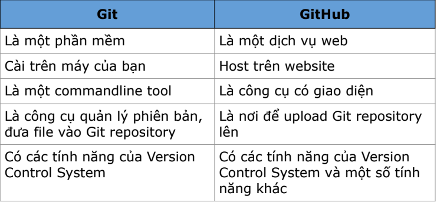

# Tổng hợp kiến thức Lesson 2: Git & JavaScript
## Version Control System:
* Khái niệm: hệ thống quản lý các phiên bản 
* 3 loại: Local - Centralize - Distributed 

## Git & Github
]

## Git Three States
Có 3 vùng: 
* **Working directory**: Các file mới hoặc file có thay đổi 
* Note: Đối với các folder/file lần đầu phải dùng câu lệnh **git init** để chuyển các file vào vùng Working directory.   Đối với các folder/file lần thứ 2 trở đi sau khi đã init thì auto ở vùng working directory*
* **Staging Area:** Các file đưa vào vùng chuẩn bị commit (tạo ra các phiên bản)
* Note: Sử dụng câu lệnh **git add <tên file>** để chuyển các file từ vùng working directory sang vùng staging area*
* **Repository:** Các commit (phiên bản)
* Note: Sử dụng câu lệnh **git commit -m "nội dung commit"** để chuyển các file từ vùng staging area qua repository.  Khi được chuyển sang vùng repository, file không còn xuất hiện trong vùng staging area.*

## Các câu lệnh git thường dùng 
* Khởi tạo thư mục được quản lý bởi git: **git init**
* Cấu hình: 1. Cho 1 repo: - **git config user.name "name"** - **git config user.email "email"** 2. Cho toàn bộ máy tính: - **git config --global user.name "name"** - **git config --global user.email "email"**
* Thêm file vào vùng Staging: 1. Thêm 1 file: **git add <file_name>** 2. Thêm toàn bộ: **git add .**
* Xem trạng thái của file: **git status** *Note: file màu xanh: ở vùng staging; file màu đỏ: ở vùng working*
* Commit: **git commit -m "message"**
* Check log: **git log**

## Commit Convention
* Quy ước commit -> Mỗi công ty/ dự án có 1 quy tắc khác nhau
* Quy ước của lớp học: **‹type>: <short_description>**
 Trong đó các type quy định như sau:  - **chore**: sửa nhỏ lẻ, chính tả, xóa file không dùng tới,... - **feat**: thêm tính năng mới, test case mới - **fix**: sửa lỗi 1 test trước đó

## Git Simple Workflow
**Init -> Config -> Add -> Commit -> push**
* Note: - init: chỉ sử dụng lần đầu khi khởi tạo - config: nếu dùng config global thì có thể bỏ qua bước này*

## Javascript
### Variable
* Variable = biến, dùng để lưu trữ giá trị, có thế thay đối giá trị được.
* Khai báo variable: **- var ‹ten_bien> = ‹gia tri>**; -> Phạm vi toàn cụ (global), Có thể khai báo lại 1 biến.  **- let ‹ten_bien> = ‹gia tri>**; -> Phạm vi cục bộ (trong 1 block code) -> Không khai báo lại biến. * Note: Nên sử dụng let để kiểm soát tốt hơn phạm vi của biến  *
* Constant = hằng số. Dùng để khai báo các giá trị không thể thay đổi.
* Khai báo: **const ‹name> = ‹value>**; *Note:  - Var/let: khi biến sẽ gán lại - const: khi biến không gán lại*

### Kiểu dữ liệu
* Có 8 loại kiểu dữ liệu: String, Number, Bigint, Boolean, Undefined, Null, Symbol, Object.

### Toán tử so sánh - Comparison operator
* So sánh hơn kém: >, <
* So sánh bằng: ==,===, !=, !==, >=,<=
* Note: Kết quả sẽ trả về dạng Boolean*

### Toán tử 1 ngôi - Unary operator
* Dùng để tăng hoặc giảm giá trị
* **i++** băng với **i=i+1**
* **i--** băng với **i=i-1**

### Toán tử số học - Arithmetic operator
* Các phép toán: +, -, *, /

### Conditional
* Điều kiện, dùng để kiểm tra có nên thực hiện một đoạn logic không
* Câu lệnh: **if (<điều kiện>) {//code}**

### Vòng lặp - Loop
* Dùng để thực hiện một đoạn logic một số lần nhất định
* Câu lệnh: **for(<khới tạo>; <điêu kiện dừng>; <điều kiện tăng>) {// code }**
