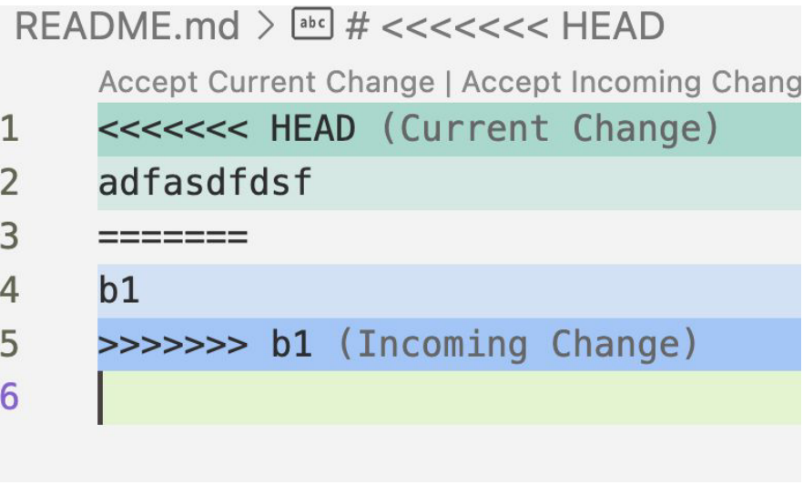

### Tổng hợp kiến thức Lesson 09 - Git & CSS Selector
## Git merge
* Merge code: gộp code từ nhánh A vào nhánh B
* Merge strategy:
  (1) Fast-forward merge:
   + Khi merge không tạo ra commit merge 
  + Xảy ra khi không có thay đổi nào trên nhánh chính kể từ lúc tạo nhánh feature
  (2) Three way merge: 
  + Khi merge có tạo ra commit merge
  + Xảy ra khi bạn muốn merge feature branch vào branch chính, mà lịch sử của 2 branch này đã có sự khác nhau
## Git Conflict
* Là xung đột. Xảy ra khi 2 người cùng sửa 1 file, sau đó merge vào với nhau
* Cách xử lý conflict:
  - Khi conflict sẽ hiển thị như sau: 
]
  - Cách xử lý conflict: 
  + Phần nằm giữa <<< HEAD và ==== là các nội dung đang ở nhánh của mình
  + Phần nằm giữa ==== và >>>> (<branch_name>) là nội dung của nhánh muốn merge vào
  + Thực hiện xóa hoặc giữ lại các phần code tương ứng
## Git Rebase
* Khái niệm: là một lệnh trong Git dùng để di chuyển hoặc tích hợp lại một chuỗi các commit từ nhánh này sang một nhánh khác, giúp làm lịch sử commit sạch và tuyến tính hơn.
* Câu lệnh: git rebase main
## Git squash
* Khái niệm: gộp nhiều commit thành một commit duy nhất. Điều này giúp làm sạch lịch sử commit
* Câu lệnh: git rebase -i HEAD~{soluong commit}
## CSS Selector
* Cú pháp đơn giản, ngắn gọn hơn
* Không sử dụng được cho các case phức tạp: contains text
* Note: Chỉ sử dụng đi xuôi (từ node trên xuống dưới), không đi ngược lên được
## Playwright Selector
Câu lệnh thường dùng: 
* page.getByRole()
* page.getByText()
* page.getByLabel()
* page.getByPlaceholder()
* page.getByAltText()
* page.getByTitle()
* page.getByTestId()