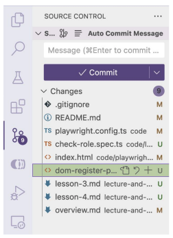

# Git & Javascript Basic (Lesson 3)

## 1. Git
### 1.1 Undo actions

#### 1.1.1 Thay đổi commit message. 
**a. Thay đổi commit message và mở soạn thảo**

    git commit --amend

- Gõ i -> vào chế độ insert
- Gõ esc để thoát insert
- Gõ ":wq" -> write and quit

**b. Thay đổi commit message và không mở soạn thảo**

    git commit --amend -m "message"

#### 1.1.2 Đưa từ vùng staging về vùng working directory

```
git restore --staged <{file}>
```

#### 1.1.3 Đưa từ vùng repository về working directory (uncommit)

```
git reset HEAD~1 (undo 1 commit)
```

### 1.2 Branching Model

- Branch = nhánh
- Dùng branch để tạo ra một vùng làm việc mới, không ảnh hưởng tới vùng làm việc đã ổn định.

**a. Không có branch**
- Backup file ra chỗ khác, copy lại.

**b. Tạo branch**
- git branch <{ten_branch}>
- git checkout <{ten_branch}>
- git checkout -b <{ten_branch}>

**Tips:**
Luôn tạo branch mới trước khi thực hiện một lệnh copy từ internet

**c. ".gitignore file"**: .gitignore = GitIgnore = Bỏ qua

- Dùng để bỏ qua các file
- Không cần git theo dõi.

```
Ignore file
    <{file_name}>

Ignore folder
    <{folder-name}>/
```
**d. Xem các thay đổi ở VS Code**



## 2. Javascript (Advance concepts)
### 2.1 Conventions

- Convention = quy tắc
- Convention giúp:
    - Code theo 1 format, dễ nhìn
    - Người khác trong team dễ đọc code

**a. Conventions**

- snake_case: (chưa dùng)
```
Ví dụ:  snake_case_now_now
```
- kebab-case: tên file
```
Ví dụ: kebab-case-now-now
```

- camelCase: tên biến
```
Ví dụ: camelCaseNowNow
```
- PascalCase: tên class

```
Ví dụ: PascalCaseNowNow
```
**b. console.log with ‘ and “, Formatted console.log**

```
console.log('Toi la Andy');
console.log("Toi la Phuong");
console.log(`${variable_name}`)
let name = "Guo Fang";
console.log(`Toi la ${name}`);
console.log("Toi ten la" + name+ "")
```
### 2.2 Objects

Object = đối tượng, dùng để lưu trữ tập hợp các giá trị vào cùng một biến hoặc hằng số
- Khai báo:
```
    let/const <ten_object> = {
        <thuoc_tinh>: <gia_tri>,
        ...
    }
```    

Trong đó:

- <thuoc_tinh>: giống quy tắc đặt tên biến

- <gia_tri>: có kiểu giống biến, hoặc là 1 object khác.

Ví dụ:

``` 
let user = {"name": "Alex", "age": 10, "email": "alex@gmail.com"

``` 
    const product = {
        "name": "Laptop",
        "price": 500,
        "isWindow": true,
        "manufacturer": {
        "name": "Acer",
        "year": 2024
    }
- Sử dụng:

```
    - console.log("name = " + user.name);

    - console.log("manufacturer name = " + product.manufacturer.name);

    - console.log("price = ", product["price"]); 
```

- Gán lại

```
    - user.age = 28
    - product["manufacturer"]["year"] = 2025 
```
   
### 2.3 Logic operator

- && : cả 2 vế của mệnh đề đều đúng
- || : một trong 2 vế đúng
- ! : đảo ngược lại giá trị của mệnh đề


### 2.4 Array

Array: Mảng

- Tạo mảng
    - Khai báo
    - Sử dụng

- Truy xuất mảng
    - Độ dài mảng: length
    - Lấy phần tử theo index: [0], [1], [2]

### 2.5 Function

- Function = hàm, là đoạn code được đặt tên và có thể tái sử dụng, thực hiện 1 nhiệm vụ hoặc 1 tính toán cụ thể.
- Khai báo

```
    function <nameFunction>() {
        // code
    }
```
- Parameter
- Return value